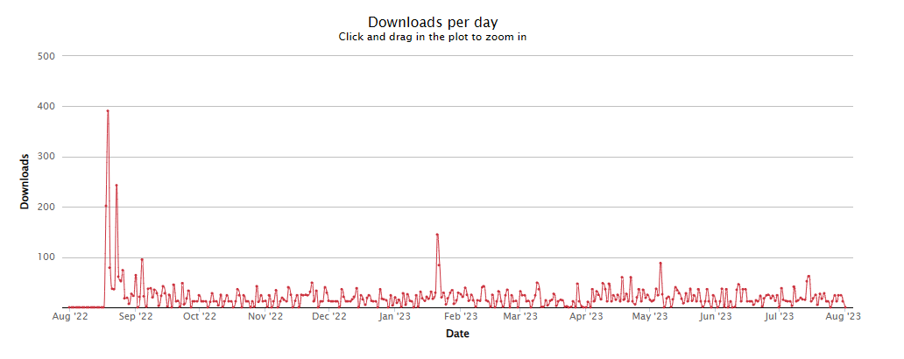
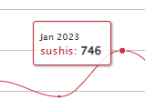
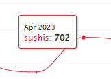

‼️ Important, components are moved to ui into common and uncommon folders, to simplify.
‼️ Down below is the guide to adapt to the new version the 3.0.0 and 3.0.1
    - [How to adapt the code to 3.0.0](#how-to-adapt-the-code-to-300)

# 🍣 SushiJS

A revolutionary framework blending Typescript, NextJS, TailwindCSS, and Framer Motion, founded on Agile principles. Introducing **NRNx2** — the evolution of Next Right Now. Crafted by the brilliant Harvard University student of Project Management, Miguel Gargallo, [@miguelgargallo](https://github.com/miguelgargallo). Brought to you by [ITAMAESAN ORG](https://itamaesan.org) — leading the development industry with Agile and Project Management methodologies.

✨ As of version 3.0.1, SushiJS is available under the PylarAI Creative ML FREE License.

## Thanks Letter

Our growth from August 2022 to May 2023 has been inspiring. With "sushis" averaging 273 monthly users and "sushis-demo" at 413 monthly users, we're thrilled by the community's support. Our commitment remains strong; we're scheduling regular bi-annual updates to ensure top-notch user experiences.

In 2022 alone, combined downloads for Sushi's software and Sushi's Demo exceeded 9815. The momentum continued into early 2023, with 4120 downloads for Sushi's software and 8250 for Sushi's Demo. This brings our total downloads to an impressive 12370.

We're also proud to note that our regular six-month update rhythm has positioned us as a reliable and comprehensive framework. For a detailed breakdown, please refer to the Downloads section.

## Table of Contents
- [🍣 SushiJS](#-sushijs)
  - [Thanks Letter](#thanks-letter)
  - [Table of Contents](#table-of-contents)
  - [npm](#npm)
  - [🌟 Features](#-features)
    - [Agile with NextJS](#agile-with-nextjs)
    - [Introducing Next Right Now 2 (NRNx2)](#introducing-next-right-now-2-nrnx2)
  - [Introduction to Common Internet Language also CIL](#introduction-to-common-internet-language-also-cil)
  - [NRNx2 Agile by ITAMAESAN](#nrnx2-agile-by-itamaesan)
  - [🚀 Getting Started](#-getting-started)
    - [Installation](#installation)
    - [Basic Usage](#basic-usage)
    - [Folder Structure](#folder-structure)
  - [Why NRNx2](#why-nrnx2)
  - [Directories](#directories)
    - [HowTo](#howto)
  - [⚙️ Updates (v3.0.1 - Aug 18th, 2023)](#️-updates-v301---aug-18th-2023)
  - [About the Aug 16th 2023 Update (3.0.0)](#about-the-aug-16th-2023-update-300)
    - [✨ Updates 2023](#-updates-2023)
    - [github 3.0.0 | npm 3.0.0](#github-300--npm-300)
    - [Table of changes](#table-of-changes)
      - [Improvements](#improvements)
      - [How to adapt the code to 3.0.0](#how-to-adapt-the-code-to-300)
  - [Recap Numbers](#recap-numbers)
    - [Downloads](#downloads)
    - [Stats Sushis Demo](#stats-sushis-demo)
    - [Downloads per Year](#downloads-per-year)
    - [Downloads per Month](#downloads-per-month)
    - [Totals](#totals)
  - [🤝 Contribute](#-contribute)
  - [📜 License](#-license)

## npm

```bash
npm i sushis
```

## 🌟 Features

- **✨ Typescript**: Robust static typing for JS.
- **📘 NextJS**: Seamless server-side rendering.
- **🌗 TailwindCSS**: Highly customizable utility-first CSS.
- **😶‍🌫️ Framer Motion**: Smooth animations.
- **🦄 Favicons**: Rich and dynamic favicon support.
- **📱 Responsive Nav**: Fluid navigation across devices.
- **🍱 Quickstart**: Git clone, npm install, and run!
- **🎉 Organized Structure**: Intuitive "modular" folder system.

### Agile with NextJS

Work seamlessly with our 4-column system:
🧠 Backlog | 👷 In Progress | ✅ Publish | 🎯 Review

### Introducing Next Right Now 2 (NRNx2)

NRN2 is the evolution of Next Right Now, a framework that introduced the Numerical Reference Number (NRN) system to manage directory identification. This system is now integrated into SushiJS.

## Introduction to Common Internet Language also CIL

CIL is a facilitator to name errors and organize your project, to enumerate folders into a web dynamic project, to ensure a faster, reliable, and efficient identification for:

- Fast Error enclave communication.
- Fast Error identification
- Easy Dev to Dev communication language
- Efficient shortened name of high paths of files

E.g.,

```tsx
./ui/uncommon/02 Body/03 Carrousel/index.ts:1:10
```

It converts into CIL, the answer is:

```rs
uu0203-1:10
```

With the introduction of SushiJS, we've solved many challenges, making the development process quicker, more straightforward, and universally understandable between devs and non-devs. This includes project managers who understand coding basics but aren't deeply involved in the project's intricate file structures.

[Go to top 🔼](#table-of-contents)

## NRNx2 Agile by ITAMAESAN

SushiJS introduced the NRNx2 Agile subsystem folder structure and development methodology. 

The second main feature of The SushiJS Framework is the ability to create components that are reusable but not necessarily general for all the pages. This is the reason why we have created the "uncommon" folder. This folder is part of the framework, and it is an extra way create components that are not general for all the pages. It contains, the same strcuture until you navigate to the "elements" folder, and the order of the imports is customizable 100% by the developer.

We simplify from this 2.0.0
 - src/uncommon/components/elementsbypage/Home
 - src/uncommon/components/elementsbypage/AboutUs
 - src/uncommon/components/elementsbypage/ContactUs
 - src/uncommon/components/elementsbypage/Menu

To this in 3.0.1
 - ui/common/
 - ui/uncommon/

NRNx2 Agile is a project management methodology that combines the best of Agile and Waterfall. It's a hybrid approach that allows for more flexibility and control over the development process.

[Go to top 🔼](#table-of-contents)

## 🚀 Getting Started

### Installation

```bash
git clone [repository_link]
npm install
```

### Basic Usage

```tsx
import Appbar from 'ui/uncommon/03_Body/13_Appbar'
```

### Folder Structure

```bash
- ui/common/
- ui/uncommon/
```

Delve deeper into folders like:
- 00 Header
- 01 Head
- 02 Body
- 03 Footer

> The "uncommon" directory is there for specialized components tailored for specific pages.

## Why NRNx2

NRN stands for Next Right Now, and x2 symbolizes the integration of SushiJS Agile. This framework introduced a Numerical Reference Number (NRN) system to manage directory identification.

## Directories

```bash
🍣 SUSHIJS FRAMEWORK
🔪---fonts
🔪---lib
🔪---src
🔪---static
🔪---styles
🔪---ui
```

### HowTo

    01: 🍚, Cook rice. <- Prepare all your pages.
    02: 🧂, Mix Vinegar, Oil, Sugar & Salt.
    03: ⏲,  Cook until sugar is dissolved.
    04: 🥣, Stir into rice.
    05: 🐟, Prepear fillings.
    06: ⬛️, Put Nori on a bamboo mat.
    07: ⬜️, Put rice with hands.
    08: 🔲, Spride rice over the nori.
    09: 🥓, Lay the filling.
    10: 🎋, Roll the bamboo mat and press.
    11: 🔪, Cut with wet knife.
    12: 🍣, Enjoy!

Take a look into the following directory structure:

    🍣 SUSHIJS FRAMEWORK
    🔪---fonts
    🔪---lib
    🔪---src
    🔪---static
    🔪---styles
    🔪---ui

```bash
    🍣 The UI Components Fix in 3.0.1
    🔪---ui
    ▒   🎋---common
    ▒   ▒   🥓---00 Header
    ▒   ▒   ▒       ⬜️---00 Meta
    ▒   ▒   ▒       ▒       🐟-----🥣 index.ts
    ▒   ▒   ▒       ▒       ⏲-----🍚 Meta.tsx
    ▒   🎋---uncommin
    ▒   ▒   🥓---02 Body
    ▒   ▒   ▒       ⬜️---06 WelcomeDescriptionText
    ▒   ▒   ▒       ▒   ⬛️---06 WelcomeDescriptionText
    ▒   ▒   ▒       ▒       🐟-----🥣 index.ts
    ▒   ▒   ▒       ▒       ⏲-----🍚 Bento.tsx
```

[Go to top 🔼](#table-of-contents)

## ⚙️ Updates (v3.0.1 - Aug 18th, 2023)

- **More Intuitive Components**: Now labeled as "ui", categorized into common and uncommon parts.
- **Consistent Updates**: Bi-annual updates for robust maintenance and support.
- **Unified Versions**: `sushis` and `sushis-demo` now sync perfectly.
- **Live Demonstration**: Check [ITAMAESAN](https://itamaesan.org).
- **Real-World Implementation**: See [BCN Hostess](https://bcnhostess.com).
- **Refinements**: Removed unused `app` folder; retained the `common` folder.
- **Enhanced Performance**: Faster installation and fewer packages.
- **Dependency Updates**: All dependencies and devDependencies are up to date.
- **Bug Fixes**: Resolved issues with `<Link>` and replaced `react-use` package.

## About the Aug 16th 2023 Update (3.0.0)

- 🧑‍💻 Due to the recent [numbers](downloads/numbers.md) we decided to update the framework every 6 months for a solid maintenance and support. Please read the [Letter](#thanks-letter) to know more about the numbers.

- 👍 Now `sushis` and `sushis-demo` are now on the same version, the transition has been complete at 100% from `2.1.2` to `3.0.0` in code and content. We notice that the this site, [ITAMAESAN](https://itamaesan.org) uses the same technology to demonstrate!

- 🎉 A real use case at [BCN Hostess](https://bcnhostess.com) uses our framework to build their commercial website!

- ✅ We maintain the essence of the framework, this means: no NextJS app folder or turbo are by the moment in our priorities, so we deleted the unused `app` folder and we maintain the `common` folder, which is the main folder of the framework. You can create it, it is still compatible with the framework, but we do not use it anymore. At your choice. See [Deprecated](./docs/legacy/assets/.security/0010103.png)

- 🌱 We improved the installation time from 9.1 seconds to 3.8 seconds, that is x2.4 times faster than before by reducing the number of packages from 395 to 372.

- 🌿 We also updated the depenendencies and devDependencies to the latest version.

- 🌳 And we fixed the `<Link>` by replacing `<a>` into `<p>` and the `useInterval` into `useState, useEffect` to delete the `react-use` package.

  Here in this table you have the details of the changes: [Table of changes](#table-of-changes)

[Go to top 🔼](#table-of-contents)

### ✨ Updates 2023

### github 3.0.0 | npm 3.0.0

This update date on Wed 16, August 2023.

We have the honor to present sushis 3.0.0 maintaining the essence of the framework.
The unique 2 changes you need to be aware of are:
 - we need to do is to replace the <a> inside the <Link> to <p> to avoid the error of the links
 - use `import React, { useState, useEffect } from 'react';` instead of `import { useInterval } from 'react-use'` to avoid the error of the links
Don't worry, down bellow the table we shown you the "how-to" / "how we" changed the code.


1. **Number of Packages**: The gh 2.1.2 npm 2.1.1 has more packages (395) compared to the gh 3.0.0 npm 3.0.0 (372), with the difference primarily due to the presence of the `react-use` package.

2. **Installation Time**: The gh 2.1.2 npm 2.1.1 takes more time (9.1 seconds) to install the additional packages, whereas the gh 3.0.0 npm 3.0.0 installs fewer packages and completes faster (3.8 seconds).

3. **Package Integrity Check**: The gh 2.1.2 npm 2.1.1 mentions the integrity check of 6061 files during installation, which may have contributed to the longer installation time. This information is not present in the gh 3.0.0 npm 3.0.0.

4. **Package Versions**: Both setups share the same oackages (unless 1) for common packages, indicating consistency in dependencies.

5. **Output Format**: The outputs have slightly different formatting, but they both include information about the installed packages and installation times.

[Go to top 🔼](#table-of-contents)

### Table of changes

  | Type                             | Name            | gh 2.1.2 npm 2.1.1 | --> | gh 3.0.0 npm 3.0.0 |
  | -------------------------------- | --------------- | ------------------ | --- | ------------------ |
  | Dependencies                     |                 |                    |     |                    |
  | @segment/in-eu                   | Dependencies    | ^0.3.0             | --> | ^0.4.0             |
  | eslint-config-prettier           | Dependencies    | ^8.6.0             | --> | ^9.0.0             |
  | framer-motion                    | Dependencies    | ^8.5.0             | --> | ^10.15.2           |
  | next                             | Dependencies    | ^12.2.5            | --> | ^13.4.16           |
  | - react-use                      | Dependencies    | ^17.4.0            |     |                    |
  | DevDependencies                  |                 |                    |     |                    |
  | @types/node                      | DevDependencies | ^18.11.18          | --> | ^20.5.0            |
  | @types/react                     | DevDependencies | ^18.0.27           | --> | ^18.2.20           |
  | @typescript-eslint/eslint-plugin | DevDependencies | ^5.48.2            | --> | ^6.4.0             |
  | @typescript-eslint/parser        | DevDependencies | ^5.48.2            | --> | ^6.4.0             |
  | autoprefixer                     | DevDependencies | ^10.4.13           | --> | ^10.4.15           |
  | eslint                           | DevDependencies | ^8.32.0            | --> | ^8.47.0            |
  | eslint-config-next               | DevDependencies | 13.1.4             | --> | 13.4.16            |
  | eslint-plugin-prettier           | DevDependencies | ^4.2.1             | --> | ^5.0.0             |
  | postcss                          | DevDependencies | ^8.4.21            | --> | ^8.4.28            |
  | prettier                         | DevDependencies | ^2.8.3             | --> | ^3.0.2             |
  | tailwindcss                      | DevDependencies | ^3.2.4             | --> | ^3.3.3             |
  | typescript                       | DevDependencies | ^4.9.4             | --> | ^5.1.6             |

#### Improvements

  | Aspect              | gh 2.1.2 npm 2.1.1 | gh 3.0.0 npm 3.0.0 |
  | ------------------- | ------------------ | ------------------ |
  | Downloaded Packages | 395                | 372                |
  | Installation Time   | 9.1 seconds        | 3.8 seconds        |

[Go to top 🔼](#table-of-contents)

#### How to adapt the code to 3.0.0

BigText.tsx

```
import { useInterval } from 'react-use'

export default function BigText({ slides }: BigTextProps) {
  const [currentSlide, setSlide] = React.useState(0)

  const totalSlides = slides.length

  useInterval(() => {
    if (totalSlides - 1 === currentSlide) {
      setSlide(0)
    } else {
      setSlide(currentSlide + 1)
    }
  }, 2000)
```	

into 

```
import React, { useState, useEffect } from 'react';
import classNames from 'lib/classNames';

interface BigTextProps {
  slides: Array<string>;
}

export default function BigText({ slides }: BigTextProps) {
  const [currentSlide, setSlide] = useState(0);

  const totalSlides = slides.length;

  useEffect(() => {
    const interval = setInterval(() => {
      if (totalSlides - 1 === currentSlide) {
        setSlide(0);
      } else {
        setSlide(currentSlide + 1);
      }
    }, 2000);

    return () => {
      clearInterval(interval);
    };
  }, [currentSlide, totalSlides]);
```

and 

CooltError.tsx

```
import { useInterval } from 'react-use'

[...]

export default function BigText({ slides }: BigTextProps) {
  const [currentSlide, setSlide] = React.useState(0)

  const totalSlides = slides.length

  useInterval(() => {
    if (totalSlides - 1 === currentSlide) {
      setSlide(0)
    } else {
      setSlide(currentSlide + 1)
    }
  }, 2000)
```

into

```
import React, { useState, useEffect } from 'react';
import classNames from 'lib/classNames';

interface BigTextProps {
  slides: Array<string>;
}

export default function BigText({ slides }: BigTextProps) {
  const [currentSlide, setSlide] = useState(0);

  const totalSlides = slides.length;

  useEffect(() => {
    const interval = setInterval(() => {
      if (totalSlides - 1 === currentSlide) {
        setSlide(0);
      } else {
        setSlide(currentSlide + 1);
      }
    }, 2000);

    return () => {
      clearInterval(interval);
    };
  }, [currentSlide, totalSlides]);
```	

[Go to top 🔼](#table-of-contents)

## Recap Numbers



### Downloads





Tools we used to make the stats:

[npm charts](https://npmcharts.com/compare/sushis,sushis-demo?interval=30&log=false)
Total number of downloads between 2022-08-01 and 2023-08-01:

package	downloads
sushis	7,545

### Stats Sushis Demo


Total number of downloads between 2022-08-01 and 2023-08-01:

package	downloads
sushis-demo	14,641

### Downloads per Year

| Year           | Downloads | Repo        |
| -------------- | --------- | ----------- |
| 2022           | 3425      | Sushis      |
| 2023 (Jan-Aug) | 4120      | Sushis      |
| 2022           | 6391      | Sushis-Demo |
| 2023 (Jan-Aug) | 8250      | Sushis-Demo |

### Downloads per Month

| Month | Downloads | Repo        |
| ----- | --------- | ----------- |
| Jan   | 746       | Sushis      |
| Jan   | 1423      | Sushis-Demo |
| Apr   | 702       | Sushis      |
| Apr   | 1405      | Sushis-Demo |

### Totals

| Year           | Downloads |
| -------------- | --------- |
| 2022           | 9816      |
| 2023 (Jan-Aug) | 12370     |

[Go to top 🔼](#table-of-contents)

## 🤝 Contribute

Feedback, contributions, and pull requests are welcome. For significant changes, please open an issue first to discuss your ideas.

## 📜 License

PylarAI Creative ML FREE License.

---

© 2023 ITAMAESAN ORG. All rights reserved.

[Go to top 🔼](#table-of-contents)
