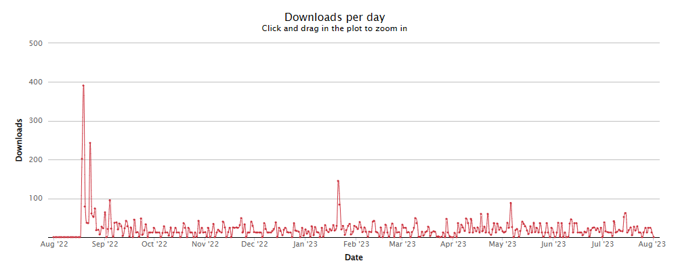
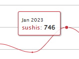
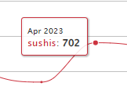
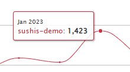
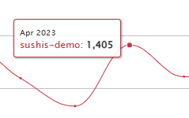
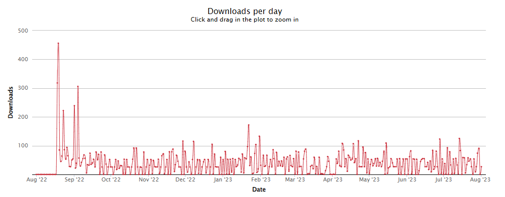

 - THIS IS A LEGACY DOCUMENTATION FOR PREVIOUS > 3.0.1!!!
 - THIS IS A LEGACY DOCUMENTATION FOR PREVIOUS > 3.0.1!!!
 - THIS IS A LEGACY DOCUMENTATION FOR PREVIOUS > 3.0.1!!!


SushiJS, is a Typescript, NextJS, TailwindCSS with Framer Framework based on Agile. Intriduces NRNx2, an evolution of Next Right Now and Agile subsystem folder structure and development methodology. Makes anybody to understand the folder structure. A new revolutionary and evolved folder "modular" structure, developed in a week (1 week exactly) by the Harvard University student of Project Management, Miguel Gargallo, @miguelgargallo. ITAMAESAN ORG is an Open Source Code Foundation, leading in the development industry based on Agile and Project Management Methodologies applied to developments.

✨ We are proud to announce, ITAMAESAN, a project to help developers, exclusive working with Open Source Pylar AI creative ML License on our code.

## About the Aug 16th 2023 Update (3.0.0)

- 🧑‍💻 Due to the recent [numbers](downloads/numbers.md) we decided to update the framework every 6 months for a solid maintenance and support. Please read the [Letter](#thanks-letter) to know more about the numbers.

- 👍 Now `sushis` and `sushis-demo` are now on the same version, the transition has been complete at 100% from `2.1.2` to `3.0.0` in code and content. We notice that the this site, [ITAMAESAN](https://itamaesan.org) uses the same technology to demonstrate!

- 🎉 A real use case at [BCN Hostess](https://bcnhostess.com) uses our framework to build their commercial website!

- ✅ We maintain the essence of the framework, this means: no NextJS app folder or turbo are by the moment in our priorities, so we deleted the unused `app` folder and we maintain the `common` folder, which is the main folder of the framework. You can create it, it is still compatible with the framework, but we do not use it anymore. At your choice. See [Deprecated](assets/.security/0010103.png)

- 🌱 We improved the installation time from 9.1 seconds to 3.8 seconds, that is x2.4 times faster than before by reducing the number of packages from 395 to 372.

- 🌿 We also updated the depenendencies and devDependencies to the latest version.

- 🌳 And we fixed the `<Link>` by replacing `<a>` into `<p>` and the `useInterval` into `useState, useEffect` to delete the `react-use` package.

  Here in this table you have the details of the changes: [Table of changes](#table-of-changes)

## Project Organizer

- [Code Internet Language in a real case use.](#code-internet-language-in-a-real-case-use)
- [NRNx2 Agile by ITAMAESAN](#nrnx2-agile-by-itamaesan)
  - [Project Management System](#project-management-system)
    - [Features](#features)
- [Why NRNx2](#why-nrnx2)
  - [HowTo](#howto)
- [Directories](#directories)
  - [NRNx2 Agile](#nrnx2-agile)
  - [Getting started](#getting-started)
  - [npm](#npm)
  - [🚀 Update log](#-update-log)
    - [Before 2.1.2](#before-212)
    - [After 3.0.0](#after-300)
    - [✨ Updates 2023](#-updates-2023)
    - [github 3.0.0 | npm 3.0.0](#github-300--npm-300)
      - [Table of changes](#table-of-changes)
      - [Improvements](#improvements)
      - [How we changed the code](#how-we-changed-the-code)
      - [github 2.1.2 | npm 2.1.1](#github-212--npm-211)
      - [github 2.0.10 | npm 2.0.10](#github-2010--npm-2010)
  - [Recap Numbers](#recap-numbers)
    - [Downloads](#downloads)
    - [Stats Sushis Demo](#stats-sushis-demo)
    - [Downloads per Year](#downloads-per-year)
    - [Downloads per Month](#downloads-per-month)
    - [Totals](#totals)
  - [Support](#support)
  - [License](#license)
  - [We run on](#we-run-on)
  - [Fix](#fix)

## Thanks Letter

Our journey has been marked by remarkable progress, as evidenced by the consistent growth in user installations. From August 2022 to May 2023, "sushis" garnered an average of around 273 users each month, while "sushis-demo" recorded an average of about 413 users per month. These figures underscore the increasing popularity of our offerings within the community. Looking forward, we are excited to announce our commitment to enhancing user experiences with regular updates, scheduled every six months. This strategic approach ensures that we continue to deliver cutting-edge solutions while maintaining the core essence that has made us a trusted framework.

We are delighted to announce that our efforts have led to remarkable results. In 2022, Sushi's Demo significantly contributed to our cause, resulting in over 6390 downloads and an impressive 3425 instances of Sushi's software being utilized. This combined effort resulted in a grand total of over 9815 downloads.

Looking ahead to the period between January and April of 2023, we are thrilled to report continued success. During this span, Sushi's software was downloaded 4120 times, while Sushi's Demo achieved an outstanding 8250 downloads. This remarkable achievement brings our cumulative total to over 12370 downloads.

Moreover, we are excited to share that our development is progressing at a steady pace. We have established a rhythm of releasing updates every six months, maintaining the core essence of our software. This consistency has led us to officially attain the status of a comprehensive framework in all respects.

See the [Downloads](#downloads) section for more details.

- [Back to top 🔼](#Project-Organizer)


## Main Features

    ✨ Typescript
    📘 NextJS
    🌗 CSS
    😶‍🌫️ Framer Motion
    🦄 Favicons
    📱 Responsive Nav
    🍱 Easy, git clone & npm install/run
    🎉 Folder organized structure

- [Back to top 🔼](#Project-Organizer)


### Agile in NextJS

First we would have to draw 4 column system.

🧠 Backlog | 👷 In Progress | ✅ Publish | 🎯 Review

Once you put the tasks on the board, you can see the order of the tasks from: 🧠 Backlog > 👷 In Progress > ✅ Publish > 🎯 Review and then, once you ended to code that component, as obviusly, you will need to develop the next one, so you return to 🧠 Backlog > 👷 In Progress > ✅ Publish > 🎯 Review with the new component, and one after one, repeatit until you have all the components done.
Then to upgrade components or add new components, you can just move the component to the next folder, and the order of the imports will be added susbecuencely the enumerations.

The second main feature of The SushiJS Framework is the ability to create components that are reusable but not necessarily general for all the pages. This is the reason why we have created the "uncommon" folder. This folder is part of the framework, and it is an extra way create components that are not general for all the pages. It contains, the same strcuture until you navigate to the "elements" folder, and the order of the imports is customizable 100% by the developer.

For example:
 - src/uncommon/components/elementsbypage/Home
 - src/uncommon/components/elementsbypage/AboutUs
 - src/uncommon/components/elementsbypage/ContactUs
 - src/uncommon/components/elementsbypage/Menu

Inside this folders you will encounter a basic folder:

    - 00 Header
    - 01 Head
    - 02 Body
    - 03 Footer

In every page, that is the reason why we have created the "uncommon" folder, it is not a folder you will use everyday, it's uncommonly to use, but is there in case you need for example, to create a specific component, for a specific page for: testing purpouse, SEO or a specific component as mentioned before, like a custome menu.

- [Back to top 🔼](#Project-Organizer)


## Introduction to Common Internet Language also CIL

Code Internet Language also CIL defined and term designed by ITAMAESAN from Miguel Gargallo in Andorra La Vella, Andorra, is to enumarate folders into a web dynamic project, to ensure a faster, reliable and efficient identification for:

    - Fast Error enclave communication.
    - Fast Error identification
    - Easy Dev to Dev communication language
    - Efficient shortened  name of high paths of files
    
eg

    -   ./src/common/components/elements/02 Body/03 Carrousel/index.ts:1:10
    
it converts into CIL, the ans is:
    
   -    C0203 or C-02/03
       
If we see the folder Strucuture:

        🔪---src
            ▒   🎋---app
            ▒   ▒   🥓---components
            ▒   ▒   🥓---styles
            ▒   🎋---common 👈👈👈 HERE FIRST REFERENCE ID FROM CIL
            ▒   ▒   🥓---components
            ▒   ▒   ▒   🔲elements
            ▒   ▒   ▒       ⬜️---00 Header
            ▒   ▒   ▒       ▒   ⬛️---00 Meta
            ▒   ▒   ▒       ⬜️---01 Head
            ▒   ▒   ▒       ▒   ⬛️---01 Menu
            ▒   ▒   ▒       ▒   ⬛️---02 SecondaryMenu
            ▒   ▒   ▒       ⬜️---02 Body 👈👈👈 HERE SECOND REFERENCE ID FROM CIL
            ▒   ▒   ▒       ▒   ⬛️---03 Carrousel 👈👈👈 HERE THIRD REFERENCE ID FROM CIL
            ▒   ▒   ▒       ⬜️---03 Footer
            ▒   ▒   ▒       ▒   ⬛️---04 Legal
            ▒   ▒   ▒       ▒   ⬛️---05 TermsAndConditions
            ▒   ▒   🥓---hooks
            ▒   ▒   🥓---types
            ▒   ▒   🥓---utils
            ▒   🎋---modules
            ▒   ▒   🥓---auth
            ▒   🎋---pages
            ▒       🥓---api
            ▒   🎋---uncommon
            ▒   ▒   🥓---components
            ▒   ▒   ▒   🔲elementsbypage
            ▒   ▒   ▒       ⬜️---01 Home
            ▒   ▒   ▒       ▒   ⬛️---00 Header
            ▒   ▒   ▒       ▒   ⬛️---01 Head
            ▒   ▒   ▒       ▒   ⬛️---02 Body
            ▒   ▒   ▒       ▒   ⬛️---03 Footer    
            ▒   ▒   ▒       ⬜️---02 404
            ▒   ▒   ▒       ▒   ⬛️---00 Header
            ▒   ▒   ▒       ▒   ⬛️---01 Head
            ▒   ▒   ▒       ▒   ⬛️---02 Body
            ▒   ▒   ▒       ▒   ⬛️---03 Footer    

You will notice, there is no error identifyn between a common and an ucommon component.
This how at SushiJS we solved many problems, making quicker, easier and common understandable, between devs, and non devs, also PM who knows to code but do need to know how the folder file system strcututire is, why and how to arrive to their destination.

- [Back to top 🔼](#Project-Organizer)


# Code Internet Language in a real case use.

We use 00 01 02 03 and many more identifications to locate so fast, efficient and reliable an error when is higlighted on the compile, server or in this case, VERCEL.


As you may see in this picture,

        ./src/common/components/elements/02 Body/27 Carrousel/index.ts:1:10
        
If we looked deeper:

        ./...common/.../02...27...

Here is the reference: C0227 or also C-02/27, where the error is being easely to remember, anotate on your Agile tools and pas throught the notes into devs to fix ASAP, with an easy message, "fix please C0227", here is where we introduce the Code Internet Language also CIL.

- [Back to top 🔼](#Project-Organizer)


# NRNx2 Agile by ITAMAESAN

SuhsiJS introduced the NRNx2 Agile subsystem folder structure and development methodology.

This is the first main aspects of SushiJS, here you will find out a Project Management System, a simple and easy to use system to manage your folders.

- [Back to top 🔼](#Project-Organizer)


## Project Management System

It's based on Agile methodology, it's a system to manage your projects and tasks.

- [Back to top 🔼](#Project-Organizer)


### Features

Directories are the main feature of this system, you can create, delete, rename and move directories, but always under a precise level of numerical identification.
The following identification levels are available:
 - 00 Header
 - 01 Head
 - 02 Body
 - 03 Footer

Inside those directories, you will encounter a second independent system of enumeration, this system is called the NRNx2 Agile, introduced by Miguel Gargallo, a software engineer student and a project manager. He studied at Harvard University and is the main developer at SushiJS.

- [Back to top 🔼](#Project-Organizer)


# Why NRNx2
NRN means Next Right Now, and x2 means the addition of SushiJS Agile, a Numerical Reference Number, NRN, a system to manage the numerical identification of the directories.

- [Back to top 🔼](#Project-Organizer)


## HowTo

    01: 🍚, Cook rice. <- Prepare all your pages.
    02: 🧂, Mix Vinegar, Oil, Sugar & Salt.
    03: ⏲,  Cook until sugar is dissolved.
    04: 🥣, Stir into rice.
    05: 🐟, Prepear fillings.
    06: ⬛️, Put Nori on a bamboo mat.
    07: ⬜️, Put rice with hands.
    08: 🔲, Spride rice over the nori.
    09: 🥓, Lay the filling.
    10: 🎋, Roll the bamboo mat and press.
    11: 🔪, Cut with wet knife.
    12: 🍣, Enjoy!

Take a look into the following directory structure:


- [Back to top 🔼](#Project-Organizer)

# Directories

    🍣 SUSHIJS FRAMEWORK
    🔪---fonts
    🔪---lib
    🔪---public
    ▒   🎋---fonts
    ▒   🎋---static
    ▒       🥓---favicons
    🔪---src
    ▒   🎋---app
    ▒   ▒   🥓---components
    ▒   ▒   ▒   🔲---GlobalStyles
    ▒   ▒   🥓---styles
    ▒   🎋---common
    ▒   ▒   🥓---components
    ▒   ▒   ▒   🔲elements
    ▒   ▒   ▒       ⬜️---00 Header
    ▒   ▒   ▒       ▒   ⬛️---00 Meta
    ▒   ▒   ▒       ▒       🐟-----🥣 index.ts
    ▒   ▒   ▒       ▒       ⏲-----🍚 Meta.tsx
    ▒   ▒   ▒       ⬜️---01 Head
    ▒   ▒   ▒       ▒   ⬛️---01 Menu
    ▒   ▒   ▒       ▒       🐟-----🥣 index.ts
    ▒   ▒   ▒       ▒       ⏲-----🍚 Sushisho.tsx
    ▒   ▒   ▒       ▒   ⬛️---02 SecondaryMenu
    ▒   ▒   ▒       ▒       🐟-----🥣 index.ts
    ▒   ▒   ▒       ▒       ⏲-----🍚 Sushiten.tsx
    ▒   ▒   ▒       ▒   ⬛️---03 MenuNotAnimated
    ▒   ▒   ▒       ▒       🐟-----🥣 index.ts
    ▒   ▒   ▒       ▒       ⏲-----🍚 SushishoUsed.tsx
    ▒   ▒   ▒       ▒   ⬛️---04 SecondaryMenuNotAnimated
    ▒   ▒   ▒       ▒       🐟-----🥣 index.ts
    ▒   ▒   ▒       ▒       ⏲-----🍚 SushitenUsed.tsx
    ▒   ▒   ▒       ▒   ⬛️---05 ToggleDarkModeButton
    ▒   ▒   ▒       ▒       🐟-----🥣 index.ts
    ▒   ▒   ▒       ▒       ⏲-----🍚 Izakaya.tsx
    ▒   ▒   ▒       ⬜️---02 Body
    ▒   ▒   ▒       ▒   ⬛️---06 WelcomeDescriptionText
    ▒   ▒   ▒       ▒       🐟-----🥣 index.ts
    ▒   ▒   ▒       ▒       ⏲-----🍚 Bento.tsx
    ▒   ▒   ▒       ▒   ⬛️---07 CardsProps
    ▒   ▒   ▒       ▒       🐟-----🥣 index.ts
    ▒   ▒   ▒       ▒       ⏲-----🍚 Arubamu.tsx
    ▒   ▒   ▒       ▒   ⬛️---08 AboutUsImages
    ▒   ▒   ▒       ▒   ⬛️---09 BrandImages
    ▒   ▒   ▒       ▒       🐟-----🧂 logo1.png
    ▒   ▒   ▒       ▒       🐟-----🧂 logo2.png
    ▒   ▒   ▒       ▒       🐟-----🧂 logo3.png
    ▒   ▒   ▒       ▒   ⬛️---10 Container
    ▒   ▒   ▒       ▒       🐟-----🥣 index.ts
    ▒   ▒   ▒       ▒       ⏲-----🍚 Container.tsx
    ▒   ▒   ▒       ▒   ⬛️---12 OurServices
    ▒   ▒   ▒       ▒   ⬛️---13 CardsPropsImproved
    ▒   ▒   ▒       ▒       🐟-----🥣 index.ts
    ▒   ▒   ▒       ▒       ⏲-----🍚 ShashinArubamu.tsx
    ▒   ▒   ▒       ▒   ⬛️---14 OurServicesText
    ▒   ▒   ▒       ▒   ⬛️---15 Bottom
    ▒   ▒   ▒       ▒       🐟-----🥣 index.ts
    ▒   ▒   ▒       ▒       ⏲-----🍚 Bottom.tsx
    ▒   ▒   ▒       ▒   ⬛️---16 Appbar
    ▒   ▒   ▒       ▒       🐟-----🥣 index.ts
    ▒   ▒   ▒       ▒       ⏲-----🍚 Appbar.tsx
    ▒   ▒   ▒       ▒   ⬛️---17 BigText
    ▒   ▒   ▒       ▒       🐟-----🥣 index.ts
    ▒   ▒   ▒       ▒       ⏲-----🍚 BigText.tsx
    ▒   ▒   ▒       ▒   ⬛️---18 BigTextExport
    ▒   ▒   ▒       ▒       🐟-----🥣 index.ts
    ▒   ▒   ▒       ▒       ⏲-----🍚 BigTextExport.tsx
    ▒   ▒   ▒       ▒   ⬛️---20 Section
    ▒   ▒   ▒       ▒       🐟-----🥣 index.ts
    ▒   ▒   ▒       ▒       ⏲-----🍚 Section.tsx
    ▒   ▒   ▒       ▒   ⬛️---21 Page
    ▒   ▒   ▒       ▒       🐟-----🥣 index.ts
    ▒   ▒   ▒       ▒       ⏲-----🍚 Page.tsx
    ▒   ▒   ▒       ▒   ⬛️---22 Carrousel
    ▒   ▒   ▒       ▒       🐟-----🥣 index.ts
    ▒   ▒   ▒       ▒       ⏲-----🍚 Carrousel.tsx
    ▒   ▒   ▒       ▒   ⬛️---22 CarrouselCards
    ▒   ▒   ▒       ▒       🐟-----🥣 index.ts
    ▒   ▒   ▒       ▒       ⏲-----🍚 Carrousel.tsx
    ▒   ▒   ▒       ▒   ⬛️---23 CoolError404
    ▒   ▒   ▒       ▒       🐟-----🥣 index.ts
    ▒   ▒   ▒       ▒       ⏲-----🍚 CooltError.tsx
    ▒   ▒   ▒       ▒   ⬛️---24 CoolError404Exporter
    ▒   ▒   ▒       ▒       🐟-----🥣 index.ts
    ▒   ▒   ▒       ▒       ⏲-----🍚 Arubamu.tsx
    ▒   ▒   ▒       ⬜️---03 Footer
    ▒   ▒   ▒       ▒   ⬛️---25 Footer
    ▒   ▒   ▒       ▒       🐟-----🥣 index.ts
    ▒   ▒   ▒       ▒       ⏲-----🍚 Footer.tsx
    ▒   ▒   🥓---hooks
    ▒   ▒   🥓---types
    ▒   ▒   🥓---utils
    ▒   🎋---modules
    ▒   ▒   🥓---auth
    ▒   ▒       🔲---api
    ▒   ▒       🔲---components
    ▒   🎋---pages
    ▒       🥓---api
    ▒           🔲---authAPI
    ▒           🔲---helloAPI
    ▒   🎋---uncommon
    ▒   ▒   🥓---components
    ▒   ▒   ▒   🔲elementsbypage
    ▒   ▒   ▒       ⬜️---01 Home
    ▒   ▒   ▒       ▒   ⬛️---00 Header
    ▒   ▒   ▒       ▒   ⬛️---01 Head
    ▒   ▒   ▒       ▒   ⬛️---02 Body
    ▒   ▒   ▒       ▒   ⬛️---03 Footer    
    ▒   ▒   ▒       ⬜️---02 404
    ▒   ▒   ▒       ▒   ⬛️---00 Header
    ▒   ▒   ▒       ▒   ⬛️---01 Head
    ▒   ▒   ▒       ▒   ⬛️---02 Body
    ▒   ▒   ▒       ▒   ⬛️---03 Footer    
    🔪---static
    ▒   🎋---favicons
    🔪---styles

- [Back to top 🔼](#Project-Organizer)


## NRNx2 Agile

Between 00 Header and 01 Head there is no main difference at all. The only difference is the order of the imports internally.
When you navigate to 02 Body, you will see that the order of the imports is a continuation of the order of the imports in 00 Header, and not a reset of the order in every directory.
If you delete the main folders:
    - 00 Header
    - 01 Head
    - 02 Body
    - 03 Footer

    More precisely, the following files are exported:

    ▒   ▒   ▒       ⬜️---00 Header
    ▒   ▒   ▒       ▒   ⬛️---00 Meta
    ▒   ▒   ▒       ▒       🐟-----🥣 index.ts
    ▒   ▒   ▒       ▒       ⏲-----🍚 Meta.tsx
    ▒   ▒   ▒       ⬜️---01 Head
    ▒   ▒   ▒       ▒   ⬛️---01 Menu
    ▒   ▒   ▒       ▒       🐟-----🥣 index.ts
    ▒   ▒   ▒       ▒       ⏲-----🍚 Sushisho.tsx
    ▒   ▒   ▒       ▒   ⬛️---02 SecondaryMenu
    ▒   ▒   ▒       ▒       🐟-----🥣 index.ts
    ▒   ▒   ▒       ▒       ⏲-----🍚 Sushiten.tsx
    ▒   ▒   ▒       ▒   ⬛️---03 MenuNotAnimated
    ▒   ▒   ▒       ▒       🐟-----🥣 index.ts
    ▒   ▒   ▒       ▒       ⏲-----🍚 SushishoUsed.tsx
    ▒   ▒   ▒       ▒   ⬛️---04 SecondaryMenuNotAnimated
    ▒   ▒   ▒       ▒       🐟-----🥣 index.ts
    ▒   ▒   ▒       ▒       ⏲-----🍚 SushitenUsed.tsx
    ▒   ▒   ▒       ▒   ⬛️---05 ToggleDarkModeButton
    ▒   ▒   ▒       ▒       🐟-----🥣 index.ts
    ▒   ▒   ▒       ▒       ⏲-----🍚 Izakaya.tsx
    ▒   ▒   ▒       ⬜️---02 Body
    ▒   ▒   ▒       ▒   ⬛️---06 WelcomeDescriptionText
    ▒   ▒   ▒       ▒       🐟-----🥣 index.ts
    ▒   ▒   ▒       ▒       ⏲-----🍚 Bento.tsx
    ▒   ▒   ▒       ▒   ⬛️---07 CardsProps
    ▒   ▒   ▒       ▒       🐟-----🥣 index.ts
    ▒   ▒   ▒       ▒       ⏲-----🍚 Arubamu.tsx
    ▒   ▒   ▒       ▒   ⬛️---08 AboutUsImages
    ▒   ▒   ▒       ▒   ⬛️---09 BrandImages
    ▒   ▒   ▒       ▒       🐟-----🧂 logo1.png
    ▒   ▒   ▒       ▒       🐟-----🧂 logo2.png
    ▒   ▒   ▒       ▒       🐟-----🧂 logo3.png

And move all directories to the root of the elements project folder, you will see that the order of the imports is functional too.
The system is developed to be easy for non relates heavy developers, or also called head of areas, or project managers Who know the basis of the programming skills, but do not know the order of the imports or projects specifications at all.
This also enables a way to order tasks as the Agile Scrum Manifesto states.

- [Back to top 🔼](#Project-Organizer)


## Getting started

    ⬇️ git clone https://github.com/itamaesanorg/SushiJS.git
    🔄 npm install
    ➡️ npm run dev
    ✨ Enjoy

- [Back to top 🔼](#Project-Organizer)


## npm

    npm i @itamaesanorg/sushijs


    ⬜⬜⬜⬜⬜⬜⬜🟧🟧🟧⬜🟧🟧⬜🟧🟧⬜🟧🟧⬜⬜⬜⬜
    ⬜⬜⬜⬜⬜🟧🟧🟧🟧⬜🟧🟧⬜🟧🟧⬜🟧🟧⬜🟧🟧🟧⬜
    ⬜⬜⬜⬜🟧⬜🟧🟧⬜🟧🟧⬜🟧🟧⬜🟧🟧⬜🟧🟧⬜🟧🟧
    🟧🟧⬜🟧⬜🟧🟧⬜🟧🟧⬜🟧🟧⬜🟧🟧⬜🟧🟧⬜🟧🟧🟧
    🟧🟧🟧🟧🟧🟧⬜🟧🟧⬜🟧🟧⬜🟧🟧⬜🟧🟧⬜🟧🟧⬜🟧
    ⬜🟧🟧🟧🟧🟧🟧🟧🟧🟧🟧🟧🟧🟧🟧🟧🟧🟧🟧🟧⬜🟧🟧
    ⬜🟧🟧🟧⬛⬜⬜⬜⬜⬜⬜⬜⬜⬜⬜⬜⬜⬜⬜🟧🟧🟧⬜
    🟧🟧🟧⬜⬛⬜⬛⬜⬜⬜⬜⬜⬜⬜⬜⬜⬛⬜⬜⬛⬜⬜⬜
    🟧🟧⬜⬜⬛⬜⬛⬛⬜⬜⬜⬜⬜⬜⬜⬜⬛⬛⬜⬛⬜⬜⬜
    ⬜⬜⬜⬜⬛⬜⬜⬜⬜⬜⬛⬜⬜⬛⬜⬜⬜⬜⬜⬛⬜⬜⬜
    ⬜⬜⬜⬜⬛⬜🟪🟪⬜⬜⬛⬛⬛⬛⬜⬜🟪🟪⬜⬛⬜⬜⬜
    ⬜⬜⬜⬜⬛⬜⬜⬜⬜⬜⬜⬜⬜⬜⬜⬜⬜⬜⬜⬛⬜⬜⬜
    ⬜⬜⬜⬜⬜⬛⬛⬛⬛⬛⬛⬛⬛⬛⬛⬛⬛⬛⬛⬜⬜⬜⬜

- [Back to top 🔼](#Project-Organizer)


## 🚀 Update log

Here you can see the updates of the framework and website.

### Before 2.1.2

```
Downloading registry.npmjs.org/next/13.4.16: 12.94 MB/12.94 MB, done
Packages: +395
++++++++++++++++++++++++++++++++++++++++++++++++++++++++++++++++++++++++++++++++++++++++++++++++++++++++++
Downloading registry.npmjs.org/@next/swc-win32-x64-msvc/13.4.16: 33.63 MB/33.63 MB, done
Packages are hard linked from the content-addressable store to the virtual store.
  Content-addressable store is at: D:\.pnpm-store\v3
  Virtual store is at:             node_modules/.pnpm
Progress: resolved 404, reused 374, downloaded 21, added 395, done

> sushis@2.1.2 prepare D:\npm\SushiJS
> husky install

husky - Git hooks installed

dependencies:
+ @segment/in-eu 0.4.0
+ eslint-config-prettier 9.0.0
+ framer-motion 10.15.2
+ next 13.4.16
+ next-themes 0.2.1
+ react 18.2.0
+ react-dom 18.2.0
+ react-use 17.4.0

devDependencies:
+ @types/node 20.5.0
+ @types/react 18.2.20
+ @typescript-eslint/eslint-plugin 6.4.0
+ @typescript-eslint/parser 6.4.0
+ autoprefixer 10.4.15
+ eslint 8.47.0
+ eslint-config-next 13.4.16
+ eslint-plugin-prettier 5.0.0
+ husky 8.0.3
+ postcss 8.4.28
+ prettier 3.0.2
+ tailwindcss 3.3.3
+ typescript 5.1.6

The integrity of 6061 files was checked. This might have caused installation to take longer.
Done in 9.1s
```

### After 3.0.0

```
Packages: +372
+++++++++++++++++++++++++++++++++++++++++++++++++++++++++++++++++++++++++++++++++++++++++++++
Packages are hard linked from the content-addressable store to the virtual store.
  Content-addressable store is at: D:\.pnpm-store\v3
  Virtual store is at:             node_modules/.pnpm
Progress: resolved 381, reused 372, downloaded 0, added 372, done

> sushis@2.1.2 prepare D:\npm\SushiJS
> husky install

husky - Git hooks installed

dependencies:
+ @segment/in-eu 0.4.0
+ eslint-config-prettier 9.0.0
+ framer-motion 10.15.2
+ next 13.4.16
+ next-themes 0.2.1
+ react 18.2.0
+ react-dom 18.2.0

devDependencies:
+ @types/node 20.5.0
+ @types/react 18.2.20
+ @typescript-eslint/eslint-plugin 6.4.0
+ @typescript-eslint/parser 6.4.0
+ autoprefixer 10.4.15
+ eslint 8.47.0
+ eslint-config-next 13.4.16
+ eslint-plugin-prettier 5.0.0
+ husky 8.0.3
+ postcss 8.4.28
+ prettier 3.0.2
+ tailwindcss 3.3.3
+ typescript 5.1.6

Done in 3.8s
```

- [Back to top 🔼](#Project-Organizer)


### ✨ Updates 2023

### github 3.0.0 | npm 3.0.0

This update date on Wed 16, August 2023.

We have the honor to present sushis 3.0.0 maintaining the essence of the framework.
The unique 2 changes you need to be aware of are:
 - we need to do is to replace the <a> inside the <Link> to <p> to avoid the error of the links
 - use `import React, { useState, useEffect } from 'react';` instead of `import { useInterval } from 'react-use'` to avoid the error of the links
Don't worry, down bellow the table we shown you the "how-to" / "how we" changed the code.


1. **Number of Packages**: The gh 2.1.2 npm 2.1.1 has more packages (395) compared to the gh 3.0.0 npm 3.0.0 (372), with the difference primarily due to the presence of the `react-use` package.

2. **Installation Time**: The gh 2.1.2 npm 2.1.1 takes more time (9.1 seconds) to install the additional packages, whereas the gh 3.0.0 npm 3.0.0 installs fewer packages and completes faster (3.8 seconds).

3. **Package Integrity Check**: The gh 2.1.2 npm 2.1.1 mentions the integrity check of 6061 files during installation, which may have contributed to the longer installation time. This information is not present in the gh 3.0.0 npm 3.0.0.

4. **Package Versions**: Both setups share the same oackages (unless 1) for common packages, indicating consistency in dependencies.

5. **Output Format**: The outputs have slightly different formatting, but they both include information about the installed packages and installation times.


#### Table of changes

  | Type                             | Name            | gh 2.1.2 npm 2.1.1 | --> | gh 3.0.0 npm 3.0.0 |
  | -------------------------------- | --------------- | ------------------ | --- | ------------------ |
  | Dependencies                     |                 |                    |     |                    |
  | @segment/in-eu                   | Dependencies    | ^0.3.0             | --> | ^0.4.0             |
  | eslint-config-prettier           | Dependencies    | ^8.6.0             | --> | ^9.0.0             |
  | framer-motion                    | Dependencies    | ^8.5.0             | --> | ^10.15.2           |
  | next                             | Dependencies    | ^12.2.5            | --> | ^13.4.16           |
  | - react-use                      | Dependencies    | ^17.4.0            |     |                    |
  | DevDependencies                  |                 |                    |     |                    |
  | @types/node                      | DevDependencies | ^18.11.18          | --> | ^20.5.0            |
  | @types/react                     | DevDependencies | ^18.0.27           | --> | ^18.2.20           |
  | @typescript-eslint/eslint-plugin | DevDependencies | ^5.48.2            | --> | ^6.4.0             |
  | @typescript-eslint/parser        | DevDependencies | ^5.48.2            | --> | ^6.4.0             |
  | autoprefixer                     | DevDependencies | ^10.4.13           | --> | ^10.4.15           |
  | eslint                           | DevDependencies | ^8.32.0            | --> | ^8.47.0            |
  | eslint-config-next               | DevDependencies | 13.1.4             | --> | 13.4.16            |
  | eslint-plugin-prettier           | DevDependencies | ^4.2.1             | --> | ^5.0.0             |
  | postcss                          | DevDependencies | ^8.4.21            | --> | ^8.4.28            |
  | prettier                         | DevDependencies | ^2.8.3             | --> | ^3.0.2             |
  | tailwindcss                      | DevDependencies | ^3.2.4             | --> | ^3.3.3             |
  | typescript                       | DevDependencies | ^4.9.4             | --> | ^5.1.6             |

#### Improvements

  | Aspect              | gh 2.1.2 npm 2.1.1 | gh 3.0.0 npm 3.0.0 |
  | ------------------- | ------------------ | ------------------ |
  | Downloaded Packages | 395                | 372                |
  | Installation Time   | 9.1 seconds        | 3.8 seconds        |

- [Back to top 🔼](#Project-Organizer)


#### How we changed the code

BigText.tsx

```
import { useInterval } from 'react-use'

export default function BigText({ slides }: BigTextProps) {
  const [currentSlide, setSlide] = React.useState(0)

  const totalSlides = slides.length

  useInterval(() => {
    if (totalSlides - 1 === currentSlide) {
      setSlide(0)
    } else {
      setSlide(currentSlide + 1)
    }
  }, 2000)
```	

into 

```
import React, { useState, useEffect } from 'react';
import classNames from 'lib/classNames';

interface BigTextProps {
  slides: Array<string>;
}

export default function BigText({ slides }: BigTextProps) {
  const [currentSlide, setSlide] = useState(0);

  const totalSlides = slides.length;

  useEffect(() => {
    const interval = setInterval(() => {
      if (totalSlides - 1 === currentSlide) {
        setSlide(0);
      } else {
        setSlide(currentSlide + 1);
      }
    }, 2000);

    return () => {
      clearInterval(interval);
    };
  }, [currentSlide, totalSlides]);
```

and 

CooltError.tsx

```
import { useInterval } from 'react-use'

[...]

export default function BigText({ slides }: BigTextProps) {
  const [currentSlide, setSlide] = React.useState(0)

  const totalSlides = slides.length

  useInterval(() => {
    if (totalSlides - 1 === currentSlide) {
      setSlide(0)
    } else {
      setSlide(currentSlide + 1)
    }
  }, 2000)
```

into

```
import React, { useState, useEffect } from 'react';
import classNames from 'lib/classNames';

interface BigTextProps {
  slides: Array<string>;
}

export default function BigText({ slides }: BigTextProps) {
  const [currentSlide, setSlide] = useState(0);

  const totalSlides = slides.length;

  useEffect(() => {
    const interval = setInterval(() => {
      if (totalSlides - 1 === currentSlide) {
        setSlide(0);
      } else {
        setSlide(currentSlide + 1);
      }
    }, 2000);

    return () => {
      clearInterval(interval);
    };
  }, [currentSlide, totalSlides]);
```	

- [Back to top 🔼](#Project-Organizer)


#### github 2.1.2 | npm 2.1.1

Fix minor code issues and delete some imports on unnecessary files, also we fixed the menu part.
We added the stats part.

#### github 2.0.10 | npm 2.0.10

- ✅ We constantly update the framework to make it more secure and stable.
- ✅ We perform this updates in Dependencies in the framework:
  - ⬆️ eslint-config-prettier to 8.6.0
  - ⬆️ framer-motion to 8.5.0
  - ⬆️ next-themes to 0.2.1
- ✅ We perform this updates in devDependencies in the framework:
  - ⬆️ types/node to 18.11.18
  - ⬆️ types/react to 18.0.27
  - ⬆️ typescript-eslint/eslint-plugin to 5.48.2
  - ⬆️ typescript-eslint/parser to 5.48.2
  - ⬆️ eslint to 8.32.0
  - ⬆️ eslint-config-next to 13.1.4
  - ⬆️ husky to 8.0.3
  - ⬆️ postcss to 8.4.21
  - ⬆️ prettier to 2.8.3
  - ⬆️ tailwindcss to 3.2.4
  - ⬆️ typescript to 4.9.4
- ✅ We perform successfull removals for non used Dependencies in the framework:
  - ❌ remove cmdk: 0.1.19
- ✅ We are now using using @next/codemod for the links!
- 📝 Now we updated the license, we are now using a Pylar AI creative ML License, you can see the license [here](https://huggingface.co/spaces/superdatas/LICENSE).

- [Back to top 🔼](#Project-Organizer)

## Recap Numbers



### Downloads






Tools we used to make the stats:

[npm charts](https://npmcharts.com/compare/sushis,sushis-demo?interval=30&log=false)
Total number of downloads between 2022-08-01 and 2023-08-01:

package	downloads
sushis	7,545

### Stats Sushis Demo



Total number of downloads between 2022-08-01 and 2023-08-01:

package	downloads
sushis-demo	14,641

- [Back to top 🔼](#Project-Organizer)

### Downloads per Year

| Year           | Downloads | Repo        |
| -------------- | --------- | ----------- |
| 2022           | 3425      | Sushis      |
| 2023 (Jan-Aug) | 4120      | Sushis      |
| 2022           | 6391      | Sushis-Demo |
| 2023 (Jan-Aug) | 8250      | Sushis-Demo |

### Downloads per Month

| Month | Downloads | Repo        |
| ----- | --------- | ----------- |
| Jan   | 746       | Sushis      |
| Jan   | 1423      | Sushis-Demo |
| Apr   | 702       | Sushis      |
| Apr   | 1405      | Sushis-Demo |

### Totals

| Year           | Downloads |
| -------------- | --------- |
| 2022           | 9816      |
| 2023 (Jan-Aug) | 12370     |


## Support

    🐣 Twitter: https://twitter.com/itamaesanorg
    🌐 Homepage: https://itamaesan.org redirects to https://SushiJS.com

- [Back to top 🔼](#Project-Organizer)


## License

    ⚖️ We are now using Pylar AI creative ML license [here](https://huggingface.co/spaces/superdatas/LICENSE).

- [Back to top 🔼](#Project-Organizer)


## We run on

    Vercel 🍣 Thanks Vercel if you read that!

- [Back to top 🔼](#Project-Organizer)


## Fix

    😍 Before dealing with the deploy please take while to read this for 100% optimization.
    [Here are posible steps before](https://github.com/itamaesanorg/edu)

- [Back to top 🔼](#Project-Organizer)

